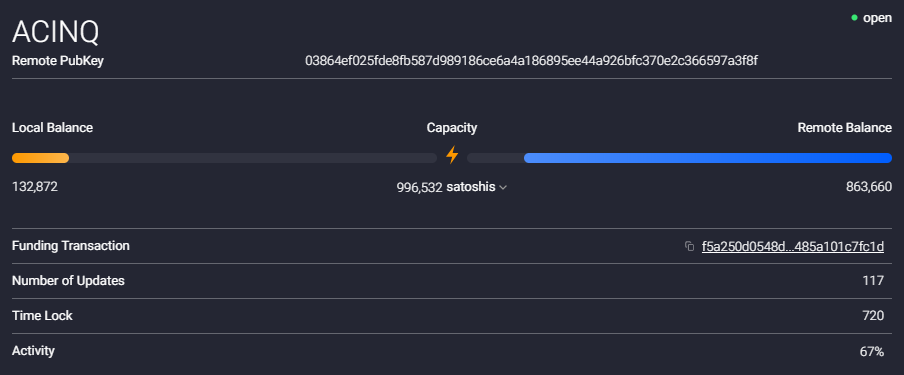
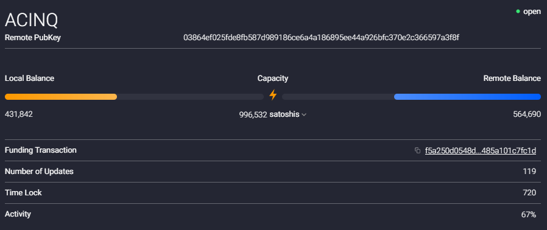
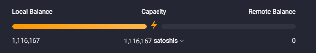
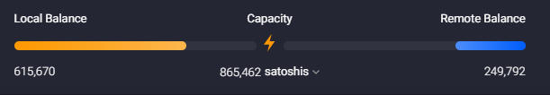
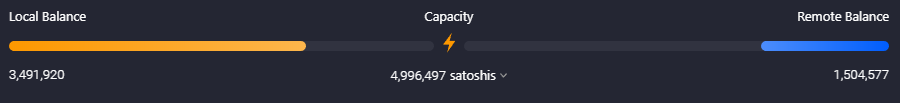
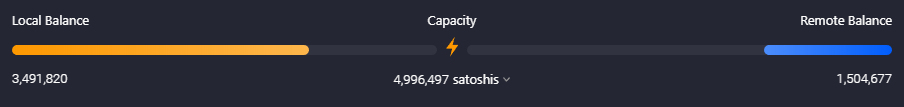
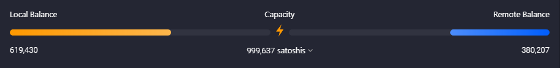
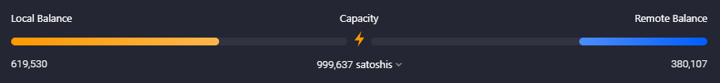

---
authors:
    - Jeremy Lucid
date: Sept 2019
keywords: bitcoin, lightning, loop, blockchain, kdb+, q, tickerplant
---
# Lightning: Loop In and Loop Out 


# Introduction

When a lightning channel is open and well balanced it can facilitate fast payments and earn fees for the node operator.
While closing a channel to settle balances on-chain can often be necessary, the act of closing incurs a financial penalty
because it requires an on-chain transaction fee be paid and the closed channel can no longer contribute towards off-chain fees.
In addition, closing and subsequently opening a new channel incurs a 'downtime' penalty because it requires 
on-chain confirmations to be received. An alternative approach is to practice lightning channel rebalancing to ensure inbound and
outbound capacities are always sufficient to facilitate bi-directional payments, avoiding the need to close channels.

[Lightning Loop](https://github.com/lightninglabs/loop) is a non-custodial service offered by [Lightning Labs](https://lightning.engineering/) to bridge on-chain and off-chain Bitcoin using submarine swaps. Loop provides a
way for lightning users to easily rebalance or refill their payment channels.

In this guide, the following types of swaps will be examained 

* Loop Out: Off-chain to On-chain, where the Loop client sends funds off-chain to receive funds on-chain
* Loop In: On-chain to Off-chain, where the Loop client sends funds on-chain to refill a channel off-chain

While the loop service will be covered below, alternative submarine swap services also exist including
https://boltz.exchange/ and http://submarineswaps.org/.


All channel images used below were generated using the non-custodial free [Zap Wallet](https://zap.jackmallers.com/).
Alternative wallets, including desktop and mobile can be found at [lopp.net](https://www.lopp.net/lightning-information.html)

# Setup and Installation

## loop and loopd

To install both the loop client and daemon, please following instructions as detailed on main [repository](https://github.com/lightninglabs/loop).
The Loop daemon, loopd, exposes a gRPC API (defaults to port 11010) and a REST API (defaults to port 8081).
Once installation is complete, run the daemon with sample command line instruction shown below.

```bash
./loopd --lnd.macaroondir=$HOME/.lnd/data/chain/bitcoin/mainnet/ --lnd.host=xxx.xxx.xxx.xx:10010 --lnd.tlspath=$HOME/.lnd/tls.cert --restlisten=xxx.xxx.xxx.xx:8081 --network=mainnet
```


## kdb+ qloopd.q

To interact with the loop daemon from q, load the qloopd.q script and call the `.loopd.loopInTerms` API to confirm you can communicate
successfully.

```q
$q qloopd.q
q).loopd.loopInTerms[]
swap_fee_base  | "1000"
swap_fee_rate  | "100"
min_swap_amount| "250000"
max_swap_amount| "2000000"
cltv_delta     | 1000
```

The qloopd.q script assumes loopd is running on the localhost and listening on the default port of 8081. In addition,
it assumes the TLS certificate is in the default location of $HOME/.lnd. If this is not the case, then the following
functions are provided to overwrite both the URL and TLS location.

```q
q).loopd.setURL["http://xxx.xxx.xxx.xx:8082/v1/loop/"]
q).loopd.setTLS["/path/to/tlscert/tls.cert"]
```

# Loop In

## Pre-Loop In: Channel balance

In the channel image below, the local balance (outbound capacity) is very low whereas the remote balance (inbound capacity)
is very high. In such a situation, the amount of funds which can be sent to the remote end is very limited and the
channel needs rebalancing to increase the outbound capacity. The local balance can be increaed using a Loop In, in
which on-chain funds are swapped for off-chain funds.



In order to perform a Loop In, the channel id first needs to be extracted. This can be done using the commands below.

```q
q)t:(uj/) enlist@'.lnd.listChannels[][`channels]
q)pubkey:"03864ef025fde8fb587d989186ce6a4a186895ee44a926bfc370e2c366597a3f8f"
q)exec chan_id from t where remote_pubkey like pubkey
"649448533229961216"
```

## Request Loop In Terms

Before performing the Loop In, the loop in terms need to be extracted from the loop service as these will be
used later to populate various values for the `.loopd.loopIn` input

```q
q).loopd.loopInTerms[]
swap_fee_base  | "1000"
swap_fee_rate  | "100"
min_swap_amount| "250000"
max_swap_amount| "2000000"
cltv_delta     | 1000
```

## Execute Loop In

```q
q)input:`amt`loop_in_channel`max_miner_fee`max_swap_fee`external_htlc!(300000;"649448533229961216";"10000";"1100";1b)
q)input
amt            | 300000
loop_in_channel| "649448533229961216"
max_miner_fee  | "10000"
max_swap_fee   | "1100"
external_htlc  | 1b
q)result:.loopd.loopIn[input]
q)result
id          | "7c21a2888dacac7dfa6f8fa47e0b49f228657bd430c9385e09e5ad3fb63a299b"
htlc_address| "3GeNFZxhZXdi69j2bd3ajrTQcPWH17HEfZ"
```

## Send on-chain payment

With the htlc_address returned, the next step is to send on-chain funds to this address.
This can be performed using the `.lnd.sendCoins` command, which is part of the [qlnd.q](https://github.com/jlucid/qlnd/blob/master/qlnd.q) script.

```q
q)ret:.lnd.sendCoins[`amount`addr!(300000;"3GeNFZxhZXdi69j2bd3ajrTQcPWH17HEfZ")]
q)ret
txid| "f83d7c47615b18e512b040eaea814caedbd042d4bab08a97dd8edf71f89c7688"
```

## Monitor

The monitoring tool can be used to check the status of the submarine swap and confirm its completion,.

```bash
$./loop monitor
Note: offchain cost may report as 0 after loopd restart during swap
2019-09-14T15:02:48+01:00 LOOP_IN INITIATED 0.003 BTC - 3GeNFZxhZXdi69j2bd3ajrTQ                                                                                         cPWH17HEfZ
2019-09-14T15:02:48+01:00 LOOP_IN HTLC_PUBLISHED 0.003 BTC - 3GeNFZxhZXdi69j2bd3                                                                                         ajrTQcPWH17HEfZ
2019-09-14T15:10:44+01:00 LOOP_IN INVOICE_SETTLED 0.003 BTC - 3GeNFZxhZXdi69j2bd3ajrTQcPWH17HEfZ (cost: server -298970, onchain 0, offchain 0)
2019-09-14T15:52:12+01:00 LOOP_IN SUCCESS 0.003 BTC - 3GeNFZxhZXdi69j2bd3ajrTQcPWH17HEfZ (cost: server 1030, onchain 0, offchain 0)
```

## Post-Loop In: Channel balance

Once the Loop In has completed, the updated local balance can be viewed on the wallet UI and confirmed
using a qsql query




```q
q)exec local_balance from t where remote_pubkey like pubkey
local_balance          | "431842"
```

# Loop Out

## Pre-Loop Out: Channel balance

In the channel image below, the local balance (outbound capacity) is nearing the total channel capacity and the remote balance (inbound capacity) is very low. In such a situation, the amount of funds which can be received is very limited and the
channel needs rebalancing to increase the inboubd capacity. The local balance can be decreased in this case using a Loop Out, in
which off-chain funds are swapped for on-chain funds.





```q
q)pubkey:"03634bda49c9c42afd876d8288802942c49e58fbec3844ff54b46143bfcb6cdfaf"
q)t:(uj/) enlist@'.lnd.listChannels[][`channels]
q)exec local_balance from t where remote_pubkey like pubkey
"1116167"
```


## Generate an on-chain address

Before performing a loop Out, a destination address on-chain needs to be specified. 
This receive address can be created within the wallet of your choice. If you wish for the funds to
be moved to an address which is controlled by the lnd node, in order to use the funds to open more channels,
the `.lnd.newaddress` function can be used to generate, as shown below.

```q
q).lnd.newaddress[]
address| "bc1qtumg8sp356nwekne62muprjcj5pj8rkn37c43y"
```

## Request Loop Out Terms

As with the previous Loop In, before performing a Loop Out the terms as enforced for the loop out swap should first
be extracted from the server.

```q
q).loopd.loopOutTerms[]
swap_fee_base  | "1000"
swap_fee_rate  | "500"
prepay_amt     | "1337"
min_swap_amount| "250000"
max_swap_amount| "2000000"
cltv_delta     | 100
```

## Request Loop Out quote

`.loopd.loopOutQuote` returns a quote for a loop out swap with the provided parameters.
For more details see [guide](https://lightning.engineering/loop/rest/index.html#v1-loop-out-quote).

```q
q).loopd.loopOutQuote["250000"]
swap_fee  | "1125"
prepay_amt| "1337"
miner_fee | "3451"
```


## Run Monitor

```bash
$./loop monitor
```


## Perform Loop out

```
q)input:`amt`loop_out_channel`dest`sweep_conf_target`max_swap_fee`max_prepay_amt`max_swap_routing_fee`max_prepay_routing_fee`max_miner_fee!("250000";"655662973008084993";"bc1qtumg8sp356nwekne62muprjcj5pj8rkn37c43y";2;"1125";"1337";"1125";"3000";"4000")
q)input
amt                   | "250000"
loop_out_channel      | "655662973008084993"
dest                  | "bc1qtumg8sp356nwekne62muprjcj5pj8rkn37c43y"
sweep_conf_target     | 2
max_swap_fee          | "1125"
max_prepay_amt        | "1337"
max_swap_routing_fee  | "1125"
max_prepay_routing_fee| "3000"
max_miner_fee         | "4000"
q)result:.loopd.loopOut[input]
q)result
id          | "7829547e8f5d0670976f5b5bf38fa4295f5a2167ecf4f01d2f8f93a72d3d47..
htlc_address| "bc1qyhd7xlv2nqeeem57ktesf375x5xt9446ytyllwxasa8k7e9rs8aswdvs9n"
```

## Check loop monitor

```bash
2019-09-24T20:29:10+01:00 LOOP_OUT INITIATED 0.0025 BTC
2019-09-24T20:30:00+01:00 LOOP_OUT PREIMAGE_REVEALED 0.0025 BTC
2019-09-24T20:30:37+01:00 LOOP_OUT SUCCESS 0.0025 BTC  
```

## Post-Loop Out: Channel balance

Once the Loop Out has completed, the updated local balance can be viewed on the wallet UI and confirmed using a qsql query



q)exec local_balance from t where remote_pubkey like pubkey

```q
q)pubkey:"03634bda49c9c42afd876d8288802942c49e58fbec3844ff54b46143bfcb6cdfaf"
q)t:(uj/) enlist@'.lnd.listChannels[][`channels]
q)exec local_balance from t where remote_pubkey like pubkey
"615670"
```


# Self-payment for channel rebalancing

Select a channel where you wish to increase the inbound capacity (Remote Balance) by making an outgoing payment.
Set the channel ID

```q
chan_id:"620042094792998913"
```




Create an invoice which will be used to pay ourselves, reducing the outbound capacity on on channel while increasing it on another.
To demonstrate we create a memo with a 100sat amount.

```q
q)invoice:`memo`value`expiry!("Self-payment of 100sat";100;"3600")
q)r:.lnd.addInvoice invoice
q)r
r_hash         | "LdX910ilNcz7GKEpV2Vof9zvIZFId0oVbuNgzqZG1AE="
payment_request| "lnbc1u1pwl7kwzpp59h2lm46g556ue7cc5y54wetg0lww7gv..."
add_index      | "50"
```

Pay the above invoice by setting the allow_self_payment flag to 1b and specifying the 
outgoing_chan_id to chan_id

```q
q)return:.lnd.sendPayment[(`payment_request`allow_self_payment`outgoing_chan_id)!(r`payment_request;1b;"620042094792998913")]
q)return
payment_preimage| "MlSkodJkm2Y35LGnQ8DOtV8gMKT/f5GGhWa0pY29+ug="
payment_route   | `total_time_lock`total_amt`hops`total_amt_msat!(609478;"100";+`chan_id`chan_capacity`amt_to_forward`expiry`amt_to_forward_msat`pub_key`tlv_payload!(("620042094792998913";"649451831779852288");("5000000";"6666666");("100";"100");609334 609334;("100000";"100000");("03864ef025fde8fb587d989186ce6a4a186895ee44a926bfc370e2c366597a3f8f";"023bc00c30acc34a5c9cbf78f84aa775cb63f578a69a6f8ec9a7600753d4f9067c");11b);"100000")
payment_hash    | "LdX910ilNcz7GKEpV2Vof9zvIZFId0oVbuNgzqZG1AE="
```

Inspect hops to confirm that the first hap was from chan_id and the return hop shows the nodes pub key.

```q
q)return[`payment_route][`hops]
chan_id              chan_capacity amt_to_forward expiry amt_to_forward_msat pub_key                                                              tlv_payload
-------------------------------------------------------------------------------------------------------------------------------------------------------------
"620042094792998913" "5000000"     "100"          609334 "100000"            "03864ef025fde8fb587d989186ce6a4a186895ee44a926bfc370e2c366597a3f8f" 1
"649451831779852288" "6666666"     "100"          609334 "100000"            "023bc00c30acc34a5c9cbf78f84aa775cb63f578a69a6f8ec9a7600753d4f9067c" 1
```

Confirm payment succeeded by inspecting the status of the last payment

```q
q)last .lnd.listPayments[][`payments]
payment_hash    | "2dd5fdd748a535ccfb18a1295765687fdcef219148774a156ee360cea646d401"
value           | "100"
creation_date   | "1577016068"
path            | ("03864ef025fde8fb587d989186ce6a4a186895ee44a926bfc370e2c366597a3f8f";"023bc00c30acc34a5c9cbf78f84aa775cb63f578a69a6f8ec9a7600753d4f9067c")
payment_preimage| "3254a4a1d2649b6637e4b1a743c0ceb55f2030a4ff7f91868566b4a58dbdfae8"
value_sat       | "100"
value_msat      | "100000"
payment_request | "lnbc1u1pwl7kwzpp59h2lm46g556ue7cc5y54wetg0lww7gv3fpm559twudsvafjx6sqsdpy2djkce3dwpshjmt9de6zqmmxyqcnqvrnv96qcqzpgxqrrsssp5n82gqsennu387dfxfyat8khmthg6e82wg5fj7v7rwklsm9p4tytqc90tyey93sa9k2squrp69sdj0q4tlpwa3qam50hk4ze7ut4ryu6szjn4gz6evzmwxklz003yrw666lzlyyajalxx9s8ytcm52ze3h3gquthdu9"
status          | "SUCCEEDED"
creation_time_ns| "1577016068000000000"
htlcs           | +`status`route!(,"SUCCEEDED";,`total_time_lock`total_amt`hops`total_amt_msat!(609478;"100";+`chan_id`chan_capacity`amt_to_forward`expiry`amt_to_forward_msat`pub_key`tlv_payload!(("620042094792998913";"649451831779852288");("5000000";"6666666");("100";"100");609334 609334;("100000";"100000");("03864ef025fde8fb587d989186ce6a4a186895ee44a926bfc370e2c366597a3f8f";"023bc00c30acc34a5c9cbf78f84aa775cb63f578a69a6f8ec9a7600753d4f9067c");11b);"100000"))
q)
```

See the channel balance change on the wallet UI




The 100sat sent from the chan_id, is reflected as an increase in outbound capacity on the channel below

Before



After



