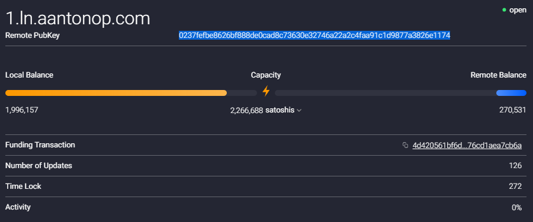

---
authors:
    - Jeremy Lucid
date: Sept 2019
keywords: bitcoin, lightning, loop, blockchain, kdb+, q, tickerplant
---
# Lightning: Loop In and Loop Out 


# Introduction

[Lightning Loop](https://github.com/lightninglabs/loop) is a non-custodial service offered by [Lightning Labs](https://lightning.engineering/) to bridge on-chain and off-chain Bitcoin using submarine swaps. Loop provides a
way for lightning network participants to easily rebalance or refill their payment channels
without having to close them. When a channel is open it has the potential to facilitate payments and earn fees which
a closed channel cannot. In addition, the act of closing a channel incurs a financial penalty, because it requires
an on-chain transaction fee be paid, and a time penalty because it requires on-chain confirmations. 

In this guide, the following types of swaps will be examained 

* Loop Out: Off-chain to On-chain, where the Loop client sends funds off-chain to receive funds on-chain
* Loop In: On-chain to Off-chain, where the Loop client sends funds on-chain to refill a channel off-chain


## Setup and Installation

### loop and loopd

To install both the loop client and daemon, please following instructions as detailed on main [repository](https://github.com/lightninglabs/loop).
The Loop daemon, loopd, exposes a gRPC API (defaults to port 11010) and a REST API (defaults to port 8081).
Once installation is complete, run the daemon with sample command line instruction shown below.

```bash
./loopd --lnd.macaroondir=$HOME/.lnd/data/chain/bitcoin/mainnet/ --lnd.host=xxx.xxx.xxx.xx:10010 --lnd.tlspath=$HOME/.lnd/tls.cert --restlisten=xxx.xxx.xxx.xx:8081 --network=mainnet
```

### kdb+: qloopd.q

To interact with the daemon from q, load the qloopd.q script, and call the `terms` API to confirm you can communicate

```q
$q qloopd.q
q).loopd.getTerms[]
```


## Monitor


```bash
$./loop monitor
```

# Loop In

## List Channel


```q
q)t:(uj/) enlist@'.lnd.listChannels[][`channels]
q)exec from t where remote_pubkey like "03864ef025fde8fb587d989186ce6a4a186895ee44a926bfc370e2c366597a3f8f", remote_balance like "863660"
active                 | 1b
remote_pubkey          | "03864ef025fde8fb587d989186ce6a4a186895ee44a926bfc370e2c366597a3f8f"
channel_point          | "f5a250d0548d466e1bce11ba2dde7a1f535d850845f83b85ec2485a101c7fc1d:0"
chan_id                | "649448533229961216"
capacity               | "1000000"
remote_balance         | "863660"
commit_fee             | "3468"
commit_weight          | "724"
fee_per_kw             | "4789"
num_updates            | "117"
csv_delay              | 720
chan_status_flags      | "ChanStatusDefault"
local_chan_reserve_sat | "10000"
remote_chan_reserve_sat| "10000"
local_balance          | "132872"
initiator              | 1b
total_satoshis_received| ""
total_satoshis_sent    | "663660"
```

## Get Terms

```q
q).loopd.loopInTerms[]
swap_fee_base  | "1000"
swap_fee_rate  | "100"
min_swap_amount| "250000"
max_swap_amount| "2000000"
cltv_delta     | 1000
```

## Run Loop In

```q
q)input:`amt`loop_in_channel`max_miner_fee`max_swap_fee`external_htlc!(300000;"649448533229961216";"10000";"1100";1b)
q)input
amt            | 300000
loop_in_channel| "649448533229961216"
max_miner_fee  | "10000"
max_swap_fee   | "1100"
external_htlc  | 1b
q)result:.loopd.loopIn[input]
q)result
id          | "7c21a2888dacac7dfa6f8fa47e0b49f228657bd430c9385e09e5ad3fb63a299b"
htlc_address| "3GeNFZxhZXdi69j2bd3ajrTQcPWH17HEfZ"
```

## Send on-chain payment

```q
q)ret:.lnd.sendCoins[`amount`addr!(300000;"3GeNFZxhZXdi69j2bd3ajrTQcPWH17HEfZ")]
q)ret
txid| "f83d7c47615b18e512b040eaea814caedbd042d4bab08a97dd8edf71f89c7688"
```

## Monitor

```bash
$./loop monitor
Note: offchain cost may report as 0 after loopd restart during swap
2019-09-14T15:02:48+01:00 LOOP_IN INITIATED 0.003 BTC - 3GeNFZxhZXdi69j2bd3ajrTQ                                                                                         cPWH17HEfZ
2019-09-14T15:02:48+01:00 LOOP_IN HTLC_PUBLISHED 0.003 BTC - 3GeNFZxhZXdi69j2bd3                                                                                         ajrTQcPWH17HEfZ
2019-09-14T15:10:44+01:00 LOOP_IN INVOICE_SETTLED 0.003 BTC - 3GeNFZxhZXdi69j2bd3ajrTQcPWH17HEfZ (cost: server -298970, onchain 0, offchain 0)
2019-09-14T15:52:12+01:00 LOOP_IN SUCCESS 0.003 BTC - 3GeNFZxhZXdi69j2bd3ajrTQcPWH17HEfZ (cost: server 1030, onchain 0, offchain 0)
```


```q
q)first select from t where remote_pubkey like "03864ef025fde8fb587d989186ce6a4a186895ee44a926bfc370e2c366597a3f8f", remote_balance like "564690"
active                 | 1b
remote_pubkey          | "03864ef025fde8fb587d989186ce6a4a186895ee44a926bfc370e2c366597a3f8f"
channel_point          | "f5a250d0548d466e1bce11ba2dde7a1f535d850845f83b85ec2485a101c7fc1d:0"
chan_id                | "649448533229961216"
capacity               | "1000000"
remote_balance         | "564690"
commit_fee             | "3468"
commit_weight          | "724"
fee_per_kw             | "4789"
num_updates            | "119"
csv_delay              | 720
chan_status_flags      | "ChanStatusDefault"
local_chan_reserve_sat | "10000"
remote_chan_reserve_sat| "10000"
local_balance          | "431842"
initiator              | 1b
total_satoshis_received| "298970"
total_satoshis_sent    | "663660"
```

# Loop Out


## Generate an on-chain address

```q
q).lnd.newaddress[]
address| "bc1qtumg8sp356nwekne62muprjcj5pj8rkn37c43y"
```

## Check loop-out terms

```q
q).loopd.loopOutTerms[]
swap_fee_base  | "1000"
swap_fee_rate  | "500"
prepay_amt     | "1337"
min_swap_amount| "250000"
max_swap_amount| "2000000"
cltv_delta     | 100
```

## Run Monitor

```bash
$./loop monitor
```

## Select channel for loop out





